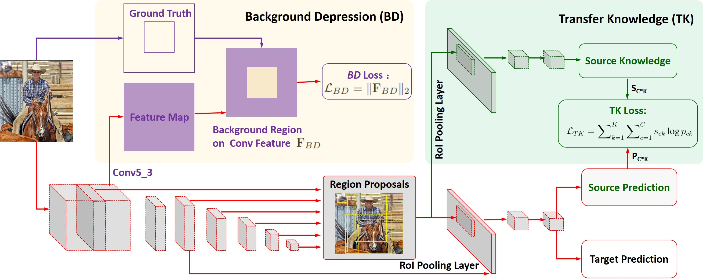
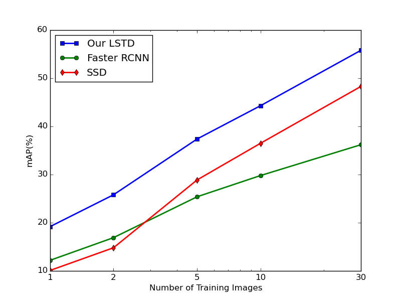

# LSTD: A Low-Shot Transfer Detector for Object Detection

### Introduction

LSTD is an unified framework for transfer object detetction with a single network. For more details, please refer to our [AAAI 2018 spotlight paper](https://arxiv.org/abs/1803.01529v1).

### Framework  
LSTD is a network combining the advantage of SSD and Faster-RCNN, where it shares the two-stage detection framework with 
the feature pyramid of SSD.

Specifically, SSD acts as the region proposal network (RPN) in LSTD.
Additionally, we propose Transfer Knowledge (TK) and Background Depression (BD) modules for transfer detection task.
More details can be found in [LSTD](https://arxiv.org/abs/1803.01529v1).

For transfer detection, our LSTD outperforms SSD and Faster RCNN significantly.
More experiments can be found in [LSTD](https://arxiv.org/abs/1803.01529v1).

### Citing LSTD

Please cite LSTD in your publicatins if it helps ypur research.

    @inproceedings{hao2018lstd,
      title = {LSTD: A Low-Shot Transfer Detector for Object Detection},
      author = {Hao Chen and Yali Wang and Guoyou Wang and Yu Qiao},
      booktitle = {AAAI},
      year = {2018}
    }

### Utility
To train/test the models, you may refer to our prototxt samples in [train.prototxt](https://github.com/Cassie94/LSTD/blob/master/models/train.prototxt), [test.prototxt](https://github.com/Cassie94/LSTD/blob/master/models/test.prototxt) and [solver.prototxt](https://github.com/Cassie94/LSTD/blob/master/models/kd_template_solver.prototxt).
